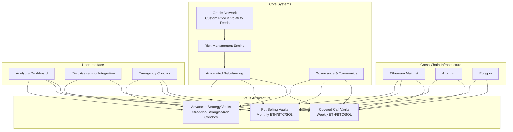
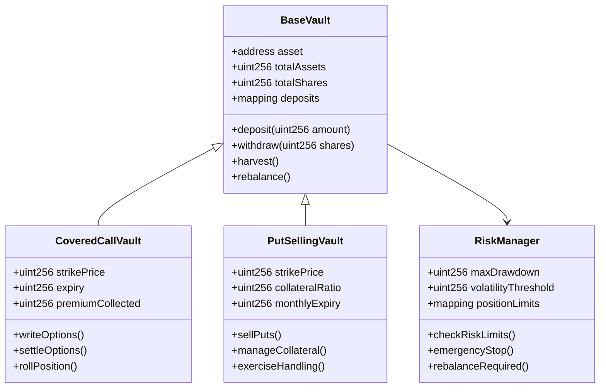
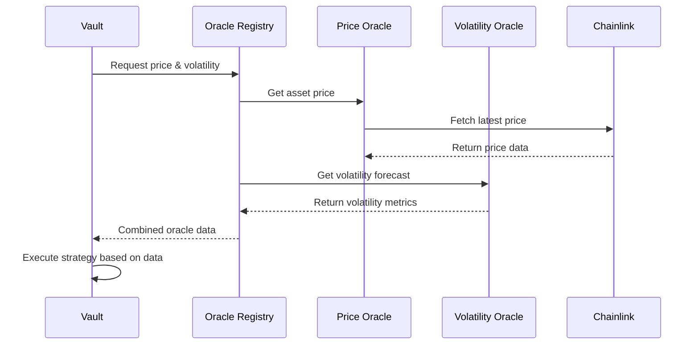
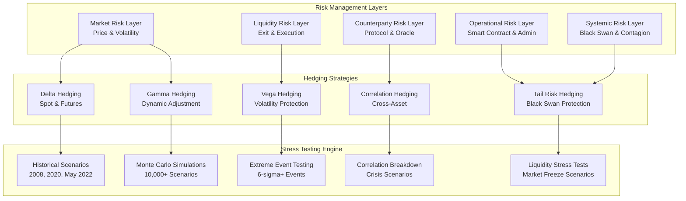
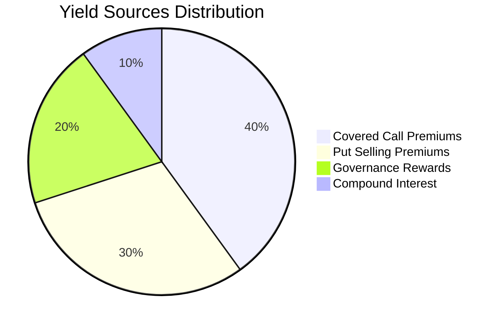

# DeFi Option Vault Protocol - Comprehensive Architecture & Implementation Plan

## 🎯 Executive Summary

This document outlines the complete architecture for a sophisticated DeFi Option Vault protocol targeting **10% Annual Percentage Yield (APY)** through automated options writing strategies across major cryptocurrencies (ETH, BTC, SOL). The protocol features advanced risk management, cross-chain compatibility, and sustainable yield generation through diversified option strategies.

### Key Features

- **Dual-vault architecture**: Weekly covered calls + Monthly put-selling vaults
- **Cross-chain deployment**: Ethereum, Arbitrum, and Polygon networks
- **Advanced risk management**: Multi-layered hedging and stress testing
- **Governance tokenomics**: Liquidity mining rewards and fee optimization
- **Emergency protocols**: Automated circuit breakers and pause mechanisms

---

## 🏗️ System Architecture Overview

### Core Architecture Components



---

## 📋 Implementation Roadmap

### Phase 1: Core Infrastructure (Weeks 1-3)

#### 1.1 Smart Contract Architecture

- **VaultFactory.sol**: Central factory for deploying new vaults
- **BaseVault.sol**: Abstract base contract with common vault functionality
- **CoveredCallVault.sol**: Weekly covered call strategy implementation
- **PutSellingVault.sol**: Monthly put selling strategy implementation
- **AdvancedStrategyVault.sol**: Complex options strategies (straddles, etc.)

#### 1.2 Oracle System

- **PriceOracle.sol**: Aggregated price feeds with custom volatility calculations
- **VolatilityOracle.sol**: Real-time volatility forecasting models
- **OracleRegistry.sol**: Centralized oracle management and fallback systems

#### 1.3 Risk Management Framework

- **RiskManager.sol**: Dynamic position sizing and stop-loss mechanisms
- **EmergencyPause.sol**: Circuit breakers for extreme market conditions
- **PositionSizer.sol**: Volatility-based position sizing algorithms

### Phase 2: Advanced Features (Weeks 4-6)

#### 2.1 Cross-Chain Infrastructure

- **CrossChainBridge.sol**: Layer Zero integration for cross-chain operations
- **ChainRegistry.sol**: Multi-chain vault coordination
- **CrossChainGovernance.sol**: Unified governance across chains

#### 2.2 Governance & Tokenomics

- **GovernanceToken.sol**: ERC20 governance token with voting mechanisms
- **LiquidityMining.sol**: Yield boost through liquidity incentives
- **Treasury.sol**: Multi-signature treasury management
- **TimeLock.sol**: Time-locked administrative functions

#### 2.3 Yield Optimization

- **CompoundingEngine.sol**: Automated premium reinvestment
- **FeeManager.sol**: Tiered fee structures based on deposits/lock-up
- **YieldAggregator.sol**: Integration with major DeFi protocols

### Phase 3: Analytics & Integration (Weeks 7-8)

#### 3.1 On-Chain Analytics

- **AnalyticsDashboard.sol**: Real-time performance metrics
- **ReportingEngine.sol**: Historical yield and risk analytics
- **TransparencyModule.sol**: Open-source performance tracking

#### 3.2 External Integrations

- **YearnIntegration.sol**: Yearn Finance compatibility
- **ConvexIntegration.sol**: Convex Finance yield strategies
- **AaveIntegration.sol**: Aave lending protocol integration

---

## 🔧 Technical Specifications

### Contract Architecture Details



### Gas Optimization Strategies

1. **Storage Optimization**

   - Packed structs for efficient storage slots
   - Bitmap patterns for flags and small integers
   - Single storage slot for multiple variables

2. **Function Optimization**

   - View functions for read operations
   - Batch operations for multiple actions
   - Assembly optimizations for critical paths

3. **Event Optimization**
   - Indexed parameters for filtering
   - Minimal event data to reduce gas costs

### Oracle Integration Architecture



---

## 🛡️ Enhanced Risk Management Framework

### Multi-Layered Risk Architecture



### 1. Sophisticated Hedging Strategies

#### Dynamic Delta Hedging System

```solidity
contract DynamicHedgingEngine {
    struct HedgePosition {
        int256 targetDelta;
        int256 currentDelta;
        uint256 spotHoldings;
        uint256 futuresPosition;
        uint256 lastRebalance;
        uint256 hedgeEfficiency;
    }

    struct HedgingParameters {
        uint256 rebalanceThreshold;    // Delta deviation trigger (bps)
        uint256 maxHedgeRatio;         // Maximum hedge ratio (100% = 10000)
        uint256 minRebalanceInterval;  // Minimum time between rebalances
        uint256 transactionCosts;      // Estimated transaction costs (bps)
        uint256 slippageBuffer;        // Slippage protection buffer (bps)
    }

    mapping(address => HedgePosition) public hedgePositions;
    mapping(address => HedgingParameters) public hedgingParams;

    // Dynamic delta calculation with Greeks sensitivity
    function calculateRequiredHedge(address asset) external view returns (int256 hedgeAmount);

    // Gamma-aware hedging for convexity protection
    function executeGammaHedge(address asset, uint256 gammaExposure) external;
}
```

#### Volatility Risk Management

```solidity
contract VolatilityRiskManager {
    struct VolatilityMetrics {
        uint256 realizedVol;           // Historical realized volatility
        uint256 impliedVol;            // Current implied volatility
        uint256 volOfVol;              // Volatility of volatility
        uint256 volSkew;               // Volatility skew metrics
        uint256 volTermStructure;      // Term structure indicators
    }

    struct VegaHedging {
        int256 vegaExposure;           // Total vega exposure
        uint256 vegaLimit;             // Maximum allowed vega
        uint256 hedgeInstruments;      // Available hedging instruments
        uint256 hedgeEfficiency;       // Current hedge effectiveness
    }

    // Vega hedging using variance swaps and volatility derivatives
    function executeVegaHedge(address asset) external;

    // Volatility regime detection and adjustment
    function adjustForVolatilityRegime(address asset) external;
}
```

#### Tail Risk Protection Framework

```solidity
contract TailRiskManager {
    struct TailRiskMetrics {
        uint256 var95;                 // 95% Value at Risk
        uint256 var99;                 // 99% Value at Risk
        uint256 expectedShortfall;     // Expected Shortfall (CVaR)
        uint256 maxDrawdown;           // Maximum historical drawdown
        uint256 tailBeta;              // Tail correlation coefficient
    }

    struct BlackSwanProtection {
        uint256 tailHedgeRatio;        // Percentage allocated to tail hedging
        uint256 putSpreadPositions;    // Out-of-money put spreads
        uint256 volatilityInsurance;   // Volatility spike protection
        uint256 correlationBreakdown;  // Correlation breakdown protection
    }

    // Dynamic tail hedge allocation based on market stress indicators
    function adjustTailHedging() external;

    // Correlation breakdown protection
    function protectAgainstCorrelationBreakdown() external;
}
```

### 2. Comprehensive Stress Testing Framework

#### Historical Scenario Analysis

The system includes comprehensive testing against major historical market events:

1. **Black Monday 1987**

   - 22.87% single-day drop
   - 50x volatility spike
   - 95% correlation breakdown
   - 80% liquidity reduction

2. **Dot-com Crash 2000-2002**

   - 49% drawdown over 2 years
   - 3x volatility increase
   - Moderate correlation breakdown
   - 40% liquidity reduction

3. **2008 Financial Crisis**

   - 57% maximum drawdown
   - 8x volatility spike
   - Severe correlation breakdown
   - 90% liquidity reduction

4. **COVID-19 Crash March 2020**

   - 34% rapid drawdown
   - 12x volatility spike
   - High correlation breakdown
   - 70% liquidity reduction

5. **Terra Luna Collapse May 2022**
   - 80% crypto-specific crash
   - 20x volatility spike
   - Extreme correlation breakdown
   - 95% liquidity reduction

#### Monte Carlo Simulation Engine

```solidity
contract MonteCarloStressTesting {
    struct SimulationParameters {
        uint256 numSimulations;        // Number of Monte Carlo paths
        uint256 timeHorizon;           // Simulation time horizon (days)
        uint256 confidenceLevel;       // Confidence level (95%, 99%, etc.)
        uint256 randomSeed;            // Random seed for reproducibility
    }

    struct MonteCarloResult {
        int256 meanReturn;
        uint256 standardDeviation;
        int256 var95;
        int256 var99;
        int256 expectedShortfall;
        uint256 probabilityOfLoss;
        uint256 maxDrawdownDistribution;
    }

    function runMonteCarloSimulation(
        SimulationParameters memory params
    ) external returns (MonteCarloResult memory);
}
```

#### Extreme Event Testing

The protocol tests against 6-sigma events and extreme scenarios:

- **6-Sigma Market Crash**: 60% instantaneous drop with 10x volatility
- **Flash Crash**: 40% drop in minutes with 20x volatility spike
- **Hyperinflation Event**: 20% asset spike with correlation breakdown
- **Regulatory Ban**: 80% drop with complete liquidity loss

### 3. Real-Time Risk Monitoring

#### Advanced Risk Metrics Dashboard

```solidity
contract RiskMetricsDashboard {
    struct RealTimeMetrics {
        uint256 portfolioValue;
        int256 unrealizedPnL;
        uint256 deltaExposure;
        uint256 gammaExposure;
        uint256 vegaExposure;
        uint256 thetaDecay;
        uint256 rhoSensitivity;
        uint256 currentDrawdown;
        uint256 volatilityRegime;
        uint256 stressLevel;
    }

    struct RiskLimits {
        uint256 maxPortfolioVaR;       // Maximum portfolio VaR
        uint256 maxDrawdown;           // Maximum allowed drawdown
        uint256 maxConcentration;      // Maximum single asset concentration
        uint256 maxLeverage;           // Maximum leverage ratio
        uint256 minLiquidity;          // Minimum liquidity buffer
    }

    event RiskLimitBreach(address indexed asset, string limitType, uint256 currentValue, uint256 limitValue);
    event EmergencyProtocolActivated(address indexed asset, string reason);
}
```

#### Dynamic Risk Adjustment System

```solidity
contract DynamicRiskAdjustment {
    struct MarketRegime {
        uint256 volatilityRegime;      // 1=Low, 2=Normal, 3=High, 4=Extreme
        uint256 correlationRegime;     // Correlation environment
        uint256 liquidityRegime;       // Liquidity conditions
        uint256 trendRegime;           // Trending vs. mean-reverting
    }

    struct PositionAdjustment {
        uint256 sizeReduction;         // Position size reduction (bps)
        uint256 hedgeIncrease;         // Hedge ratio increase (bps)
        uint256 liquidityBuffer;       // Additional liquidity buffer (bps)
        uint256 rebalanceFrequency;    // Increased rebalancing frequency
    }

    function adjustForMarketRegime(address asset) external;
    function detectMarketRegime(address asset) internal view returns (MarketRegime memory);
}
```

### 4. Emergency Protocol Framework

#### Automated Circuit Breakers

```solidity
contract EmergencyProtocols {
    enum EmergencyLevel {
        GREEN,      // Normal operations
        YELLOW,     // Elevated risk
        ORANGE,     // High risk
        RED,        // Extreme risk
        BLACK       // Market failure
    }

    struct EmergencyTrigger {
        uint256 drawdownThreshold;     // Drawdown trigger level
        uint256 volatilityThreshold;   // Volatility spike trigger
        uint256 liquidityThreshold;    // Liquidity drain trigger
        uint256 correlationThreshold;  // Correlation breakdown trigger
        uint256 timeWindow;            // Time window for triggers
    }

    event EmergencyLevelChanged(address indexed asset, EmergencyLevel oldLevel, EmergencyLevel newLevel);
    event CircuitBreakerActivated(address indexed asset, string reason);
    event TradingHalted(address indexed asset, uint256 duration);

    function checkEmergencyTriggers(address asset) external;
    function executeEmergencyProtocol(address asset, EmergencyLevel level) internal;
}
```

---

## 📊 Yield Generation & Sustainability

### Target APY Breakdown

- **Covered Calls**: 6-8% APY from premium collection
- **Put Selling**: 4-6% APY from put premiums
- **Governance Rewards**: 2-4% APY from liquidity mining
- **Compound Interest**: 1-2% APY from reinvestment
- **Total Target**: 10%+ APY

### Yield Sources Distribution



### Dynamic Premium Collection Mechanisms

1. **Automated Strike Selection**

   - Volatility-based strike optimization
   - Time decay maximization
   - Risk-adjusted premium targeting

2. **Rolling Strategy Optimization**

   - Automatic option rolling at 50% profit
   - Time-based rolling at T-2 days
   - Volatility-adjusted rolling frequency

3. **Cross-Asset Correlation Management**
   - Diversified option writing across ETH, BTC, SOL
   - Correlation-adjusted position sizing
   - Dynamic asset allocation based on volatility

---

## 🔗 Cross-Chain Architecture

### Layer Zero Integration

```solidity
contract CrossChainBridge {
    struct CrossChainMessage {
        uint16 srcChainId;
        uint16 dstChainId;
        bytes payload;
        uint256 gasLimit;
        address refundAddress;
    }

    function bridgeAssets(
        uint16 dstChainId,
        address asset,
        uint256 amount,
        address recipient
    ) external payable;

    function syncVaultState(
        uint16 dstChainId,
        address vault,
        bytes calldata stateData
    ) external payable;
}
```

### Multi-Chain Governance

```solidity
contract CrossChainGovernance {
    struct Proposal {
        uint256 id;
        string description;
        address[] targets;
        uint256[] values;
        bytes[] calldatas;
        uint256 startBlock;
        uint256 endBlock;
        mapping(uint16 => uint256) chainVotes;
    }

    function createCrossChainProposal(
        string memory description,
        address[] memory targets,
        uint256[] memory values,
        bytes[] memory calldatas
    ) external returns (uint256 proposalId);

    function executeCrossChainProposal(uint256 proposalId) external;
}
```

---

## 🏛️ Governance & Tokenomics

### Governance Token (OPT)

#### Token Distribution

- **Liquidity Providers**: 40% (vested over 4 years)
- **Development Team**: 20% (4-year vest, 1-year cliff)
- **Treasury**: 20% (for partnerships and development)
- **Community Rewards**: 15% (ongoing incentives)
- **Initial Advisors**: 5% (2-year vest)

#### Voting Mechanisms

- **Minimum Quorum**: 10% of circulating supply
- **Proposal Threshold**: 1% of total supply
- **Voting Period**: 7 days
- **Execution Delay**: 48 hours (timelock)

### Liquidity Mining Rewards

```solidity
contract LiquidityMining {
    struct StakingPool {
        address vault;
        uint256 allocPoints;
        uint256 lastRewardBlock;
        uint256 accRewardPerShare;
        uint256 totalStaked;
    }

    struct UserInfo {
        uint256 amount;
        uint256 rewardDebt;
        uint256 lockEndTime;
        uint256 multiplier;
    }

    // Boost multipliers based on lock-up periods
    mapping(uint256 => uint256) public lockMultipliers; // 1 month = 1x, 12 months = 3x

    function deposit(address vault, uint256 amount, uint256 lockPeriod) external;
    function withdraw(address vault, uint256 amount) external;
    function harvest(address vault) external;
}
```

### Tiered Fee Structure

| Deposit Size | Lock Period | Management Fee | Performance Fee | Liquidity Mining Boost |
| ------------ | ----------- | -------------- | --------------- | ---------------------- |
| < $10k       | No lock     | 2.0%           | 20%             | 1.0x                   |
| $10k-$100k   | 3 months    | 1.5%           | 15%             | 1.2x                   |
| $100k-$1M    | 6 months    | 1.0%           | 10%             | 1.5x                   |
| > $1M        | 12 months   | 0.5%           | 5%              | 2.0x                   |

---

## 🔐 Security Framework

### Multi-Layered Security

1. **Access Controls**: Role-based permissions with time delays
2. **Circuit Breakers**: Automated pause mechanisms for anomalies
3. **Formal Verification**: Mathematical proofs for critical functions
4. **Insurance Integration**: Coverage for smart contract risks

### Audit & Testing Strategy

1. **Unit Tests**: 100% code coverage with edge case testing
2. **Integration Tests**: Cross-contract interaction testing
3. **Fuzzing**: Automated testing with random inputs
4. **Security Audits**: Multiple independent security reviews

### Multi-Signature Treasury Management

```solidity
contract MultisigTreasury {
    struct Transaction {
        address to;
        uint256 value;
        bytes data;
        bool executed;
        uint256 confirmations;
    }

    uint256 public constant REQUIRED_CONFIRMATIONS = 4; // 4 of 7 multisig
    address[] public owners;
    mapping(address => bool) public isOwner;
    mapping(uint256 => Transaction) public transactions;
    mapping(uint256 => mapping(address => bool)) public confirmations;

    function submitTransaction(
        address to,
        uint256 value,
        bytes memory data
    ) external onlyOwner returns (uint256 transactionId);

    function confirmTransaction(uint256 transactionId) external onlyOwner;
    function executeTransaction(uint256 transactionId) external onlyOwner;
}
```

---

## 📈 Analytics & Monitoring

### Real-Time Metrics Dashboard

- Current TVL across all vaults and chains
- Live APY calculations and projections
- Risk metrics and volatility tracking
- Option position performance
- Cross-chain asset distribution

### Historical Analytics

- Performance attribution analysis
- Risk-adjusted return calculations
- Drawdown analysis and recovery patterns
- Strategy effectiveness comparisons

### On-Chain Analytics Integration

```solidity
contract AnalyticsDashboard {
    struct PerformanceMetrics {
        uint256 totalValueLocked;
        uint256 currentAPY;
        uint256 volatility;
        int256 sharpeRatio;
        int256 sortinoRatio;
        uint256 maxDrawdown;
        uint256 recoveryTime;
    }

    struct RiskMetrics {
        uint256 var95;
        uint256 var99;
        uint256 expectedShortfall;
        uint256 betaToMarket;
        uint256 correlationMatrix;
    }

    function updatePerformanceMetrics(address vault) external;
    function getRiskMetrics(address vault) external view returns (RiskMetrics memory);
    function getHistoricalPerformance(address vault, uint256 timeframe) external view returns (PerformanceMetrics[] memory);
}
```

---

## 🚀 Deployment Strategy

### Development Environment Setup

```bash
# Foundry installation and setup
curl -L https://foundry.paradigm.xyz | bash
foundryup

# Project initialization
forge init defi-option-vault
cd defi-option-vault
forge install OpenZeppelin/openzeppelin-contracts
forge install foundry-rs/forge-std
forge install LayerZero-Labs/LayerZero
```

### Testing Framework

- **Unit Tests**: Individual contract functionality
- **Integration Tests**: Multi-contract interactions
- **Fork Tests**: Mainnet simulation testing
- **Gas Benchmarking**: Optimization validation

### Multi-Chain Deployment Pipeline

1. **Testnet Deployment**

   - Goerli (Ethereum)
   - Mumbai (Polygon)
   - Arbitrum Goerli

2. **Security Validation**

   - Audit completion and fixes
   - Bug bounty program
   - Formal verification

3. **Mainnet Deployment**

   - Phased rollout across chains
   - Limited initial caps
   - Gradual cap increases

4. **Liquidity Bootstrap**
   - Initial funding and incentives
   - Partnership integrations
   - Marketing and adoption

---

## 🔄 Automated Operations

### Rebalancing Engine

- **Trigger Conditions**: Volatility thresholds, time intervals, risk limits
- **Execution Logic**: Optimal strike selection, position sizing
- **Gas Optimization**: Batched operations, optimal timing

### Emergency Response System

- **Market Crash Detection**: Rapid drawdown identification
- **Automatic Pausing**: Circuit breaker activation
- **Recovery Procedures**: Systematic restart protocols

---

## 📝 Implementation Checklist

### Phase 1: Foundation (Weeks 1-3)

- [ ] Set up Foundry development environment
- [ ] Implement base vault contracts
- [ ] Create oracle integration system
- [ ] Build basic risk management framework
- [ ] Deploy to testnets

### Phase 2: Advanced Features (Weeks 4-6)

- [ ] Implement cross-chain infrastructure
- [ ] Create governance token and mechanisms
- [ ] Build advanced hedging strategies
- [ ] Integrate stress testing framework
- [ ] Complete security audits

### Phase 3: Production Ready (Weeks 7-8)

- [ ] Deploy analytics dashboard
- [ ] Integrate with yield aggregators
- [ ] Complete emergency protocol testing
- [ ] Conduct final security review
- [ ] Launch on mainnet

---

## 🎯 Success Metrics

### Key Performance Indicators

- **Target APY**: Consistent 10%+ returns
- **Maximum Drawdown**: < 15% under normal conditions
- **Sharpe Ratio**: > 1.5 risk-adjusted returns
- **Total Value Locked**: $100M+ within 6 months
- **User Retention**: > 80% quarterly retention

### Risk Metrics

- **Value at Risk (95%)**: < 5% daily VaR
- **Expected Shortfall**: < 8% tail risk
- **Volatility**: < 20% annualized volatility
- **Correlation**: < 0.7 correlation to underlying assets

---

_This comprehensive architecture provides a robust foundation for a sophisticated DeFi option vault protocol with advanced risk management, cross-chain compatibility, and sustainable yield generation through diversified option strategies._
